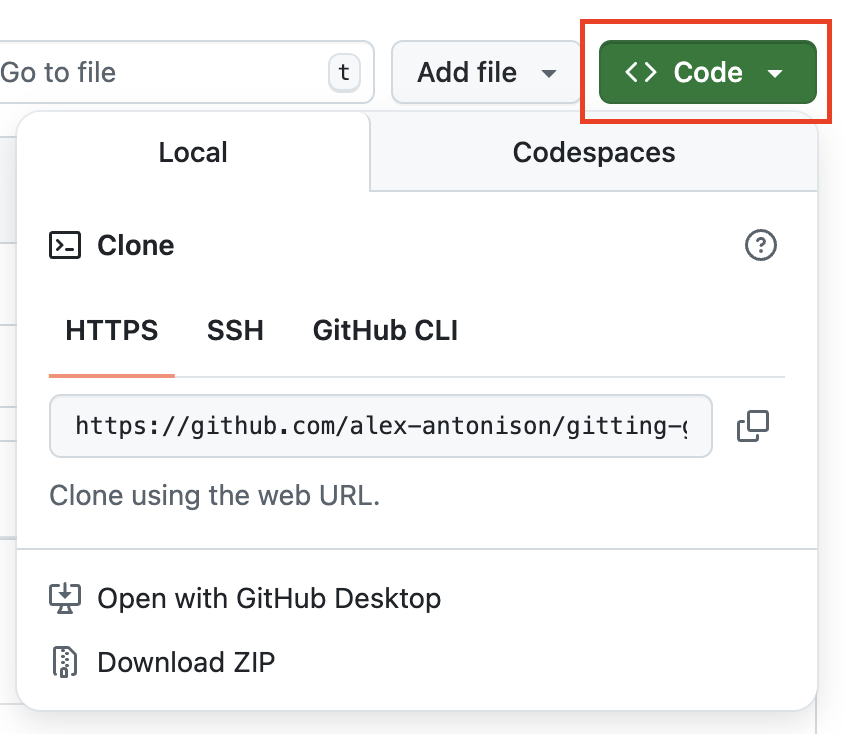

# **Module 2 - Basic Git Operations**

* Getting started working with Repositories
* Committing Changes
* Undoing Changes
* Ignoring and Removing Files

---
layout: two-cols
---

# **Getting started working with Repositories**
<div class="text-2xl">

1. [Creating a repository](https://docs.github.com/en/repositories/creating-and-managing-repositories/quickstart-for-repositories)
2. [Forking a repository](https://docs.github.com/en/pull-requests/collaborating-with-pull-requests/working-with-forks/fork-a-repo#forking-a-repository)

[github.com/alex-antonison/gitting-good-at-github](https://github.com/alex-antonison/gitting-good-at-github)

Once a repository has been created or forked, you can then clone a repository with
</div>
```bash
git clone {repository link}
```

::right::



---

# **Committing Changes**
<div class="text-2xl">

* You can either add all files with `git add -A` or `git add {file name}`
* Once a file is being tracked, you can then `commit` the changes with `git commit -m"{insert message here}"`
  * When do you commit?
    * Committing too often leads to noisy commits
    * Committing too infrequently makes it hard to find changes
  * _The best time to commit is when you have completed a "thought"_
    * This could be when you finish a function, update some business logic, etc.
</div>

---

# **Committing Changes (Activity)**

1. Create a file in `exercises` called `new_file.txt`
2. Add some text to it.
3. `git add {file name}.md`
4. `git commit -m "{insert your descriptive message here}"`
5. Check **Commit History.** You can use `git log` but GitHub Desktop or VS Code is easier

---

# **Undoing Changes**

<div class="text-2xl">

* `git commit --amend` allows you to change the last commit
  * Update git commit message
* `git reset HEAD~1`
  * This simply undoes the last commit
* `git revert HEAD`
  * This will create a new commit reverting your last commit
* `git checkout origin/main {path/to/file name}`
  * This will reset the file to what is in the main branch
</div>

---

# **Undoing Changes (Activity)**

TODO: Activity

---

# **Ignoring and Removing Files**

* A `.gitignore` file is used to ignore files that you do not want to manage in source control. Some examples are:
  * Files containing secrets (passwords, API keys, etc.)
  * Locally installed package files like `.venv/`
  * Large data files (aka 2 GB csv files)
* In the event a file gets added that you want to remove, you can use the command `git rm --cache /path/to/filename`

---

# **Ignoring and Removing Files (Activity)**

TODO: Ignore and remove activity
