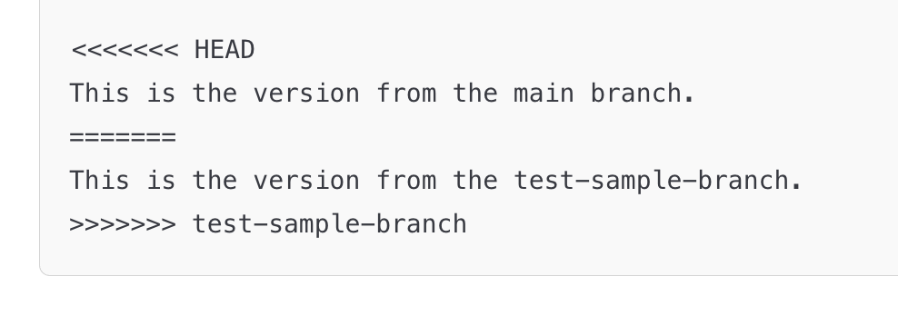

# **Module 3 - Branching and Merging**

* What are Branches
* Working with Branches
* Merging Branches
* Rebasing Branches
* Merge Conflicts

---

# **What are Branches?**

* A branch lets you work on changes separately from the main code.
  * For individual projects, working in `main` is "okay"
  * It is a good habit to always work in branches
  * For team based projects, always need to work in branches

---

# **Working with Branches**

* Create a branch and then checkout that branch:
  * Create a branch `git branch {insert-descriptive-branch-name}`
* To change to a branch
  * `git checkout {insert-descriptive-branch-name}`
  * `git switch {insert-descriptive-branch-name}`
* Create and change to a branch
  * `git checkout -b {insert-descriptive-branch-name}`
  * `git switch -c {insert-descriptive-branch-name}`
* To delete a branch
  * `git checkout main`
  * `git branch -D {insert-descriptive-branch-name}`

---

# **Working with Branches (Activity)**

1. Create a branch `git switch -c my-new-branch`
2. Delete the branch:
   1. `git checkout main`
   2. `git branch -D my-new-branch`

---

# **Merging Branches**

* To merge a branch locally, you do `git merge {insert-branch-name}`
* It is common to need to merge `main` into current branch because:
  * In your Pull Request, you have merge conflicts you need to address
  * Code has been merged into main that you need for your work
* To merge main into your current branch
  * `git checkout main` (swap to main)
  * `git pull` (update main branch)
  * `git checkout {insert-branch-name}` (swap back to your branch)
  * `git merge main` (merge main into your branch)

---

# **Merging Branches (Activity)**

1. Create a branch `git branch add-feature`
2. Create a file `branch_test_file.txt` and add it
   1. `git add branch_test_file.txt`
   2. `git commit -m "Add branch test file"`
3. `git checkout add-feature` (Swap to add-feature branch)
4. Merge main into `add-feature` branch
   1. `git merge main`

---

# **Merging Pros and Cons**

* **Pros**
  * Preserves full branch history, so you can trace what happened in team work
  * Safe for collaboration because merge does **not** rewrite existing commits
  * PR context stays connected to the merged work
* **Cons**
  * Extra merge commits can make history feel noisy over time
  * Commit history is less linear and can be harder to read quickly
  * Long-lived branches can lead to more merge conflicts

---

# **Rebasing**

* Rebasing replays a branch's commits on top of another branch's latest commit
* Unlike merging, rebasing rewrites commit history to produce a linear history
* To rebase main into your current branch:
  * `git switch main` (swap to main)
  * `git pull` (update main branch)
  * `git checkout {insert-branch-name}` (swap back to your branch)
  * `git rebase main` (rebase your branch on top of main)
* **Avoid rebasing branches that others are working on** — rewriting shared history can cause problems

---

# **Rebasing (Activity)**

1. Create and switch to your feature branch from `main`:
    1. `git checkout main`
    2. `git switch -c add-feature`
2. Make your feature change and commit it:
    1. Create `rebase_test_file.txt`, then run `git add rebase_test_file.txt`
    2. `git commit -m "add feature work"`
3. Simulate main moving ahead, then rebase your branch:
    1. `git checkout main` and commit a change to `exercises/existing_file.txt`
    2. `git checkout add-feature`
    3. `git rebase main`
4. Move `main` to include the rebased feature commits:
    1. `git checkout main`
    2. `git rebase add-feature`

---

# **Rebasing Pros and Cons**

* **Pros**
  * Creates a clean, linear commit history that is easier to scan
  * Helps keep feature work up to date without adding merge commits
  * Makes `git log --oneline` and history review simpler for many teams
* **Cons**
  * Rewrites commit history, which can confuse collaborators on shared branches
  * Can require force push (`git push --force-with-lease`) after rebasing remote branches
  * Conflict resolution may need to happen commit-by-commit during the rebase

---
layout: two-cols
---

# **Merge Conflicts**

* Occurs when changes in two branches **affect the same part of a file** and Git can't automatically decide which change to keep, requiring manual resolution.

::right::

  

---

# **Merge Conflict (Activity)**

1. `git checkout main` (swap back to main)
2. Make a change to the first line in `exercises/existing_file.txt`
3. `git commit -am"Commit message for existing_file.txt"`
4. `git checkout add-feature` (swap back to add-feature)
5. Make a different change to the first line in `exercises/existing_file.txt`
6. `git commit -am"Commit message for existing_file.txt"`
7. Run `git merge main`
8. You can use the built in VS Code or GitHub Desktop to resolve the conflict.

