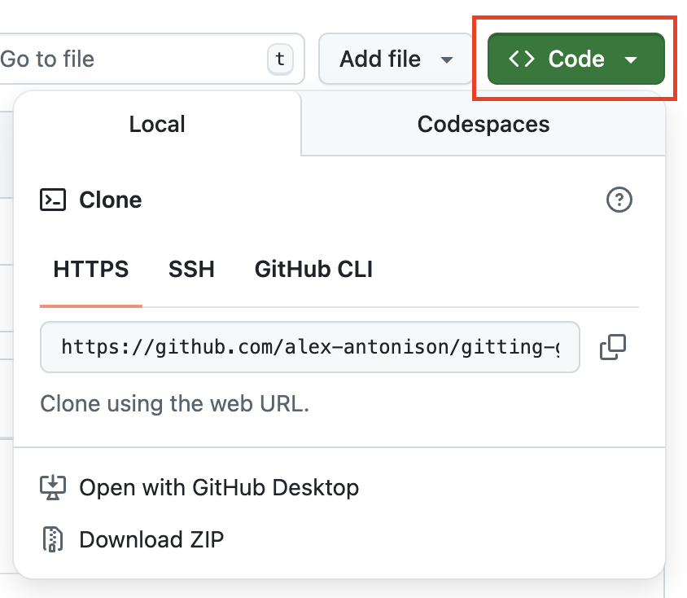

# **Module 5 - Simulated Project**

This is a sample project for testing working with GitHub

[https://github.com/alex-antonison/git-r-done-enterprises-2026-09-24](https://github.com/alex-antonison/git-r-done-enterprises-2026-09-24)

Use the **Code** button to grab the clone URL

::right::

  

